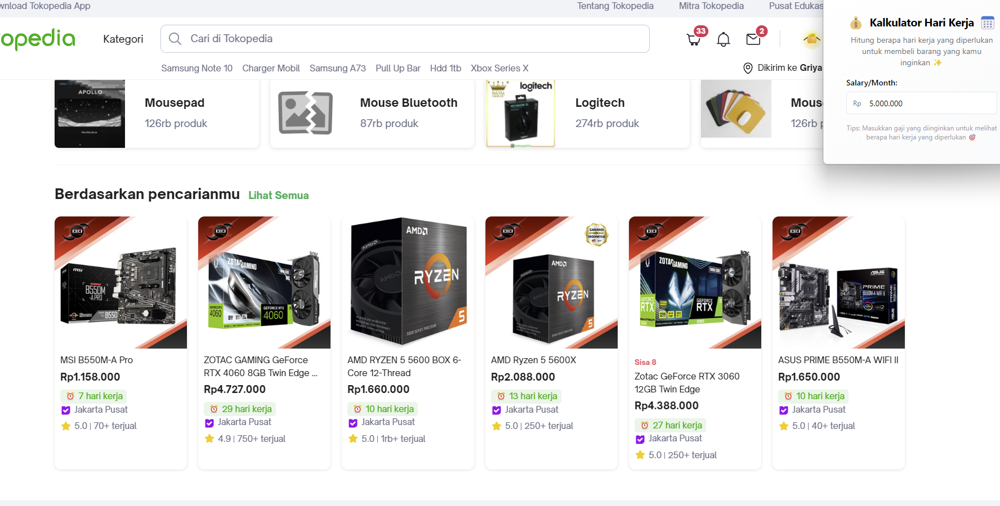

# Ecommerce Tools Extension
🛍️ A browser extension that helps users shop online with various utility features. ✨





## Website Supports

- Tokopedia
- Shopee

## Features

- Salary Day To Work Converter : Convert your salary to working days needed to buy items on Ecommerce.
- Coming Soon!

## Tech Stack

- React + TypeScript
- Tailwind CSS
- Shadcn/ui
- Chrome Extension API
- Plasmo

## Installation Guide

### How to install with released package:
   - Download the latest `.zip` file from the [releases page](https://github.com/basstimam/ecommerce-tools/releases)
   - Extract the downloaded `.zip` file
   - Open Chrome/Edge browser
   - Go to extensions page (chrome://extensions)
   - Enable "Developer mode"
   - Click "Load unpacked"
   - Select the extracted folder


## Development

For development mode:
```bash
npm run dev
```

## Project Structure

```
├── src/
│   ├── components/
│   ├── hooks/
│   ├── lib/
│   ├── popup.tsx
│   └── content.ts
```

## Contributing

Please create a pull request to contribute. For major changes, please open an issue first to discuss the desired changes.

## License

[MIT License](LICENSE)
